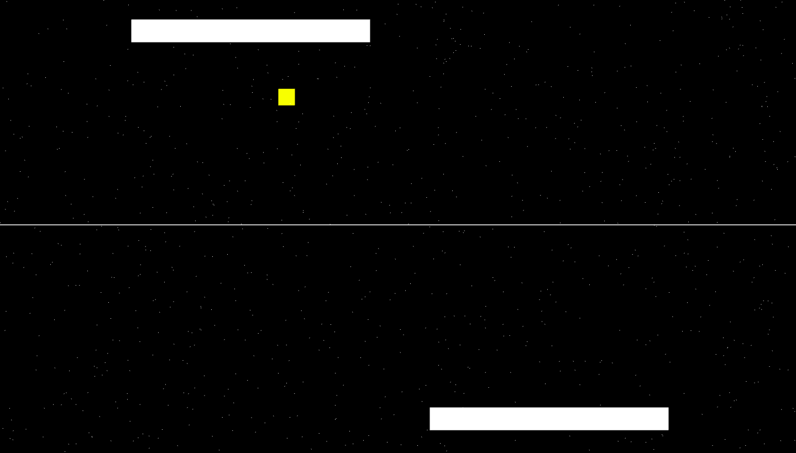

# WebGLSpacePong
Just a very basic pong-style game written as a quick hack using the code from the WebGLShapes repo.

## Controls

The player on the top performs the movements using the A and D keys on the keyboard, and the player on the bottom uses the left arrow and the right arrow keys.

## Sound effects

Sounds inspired by the original pong game were used.

